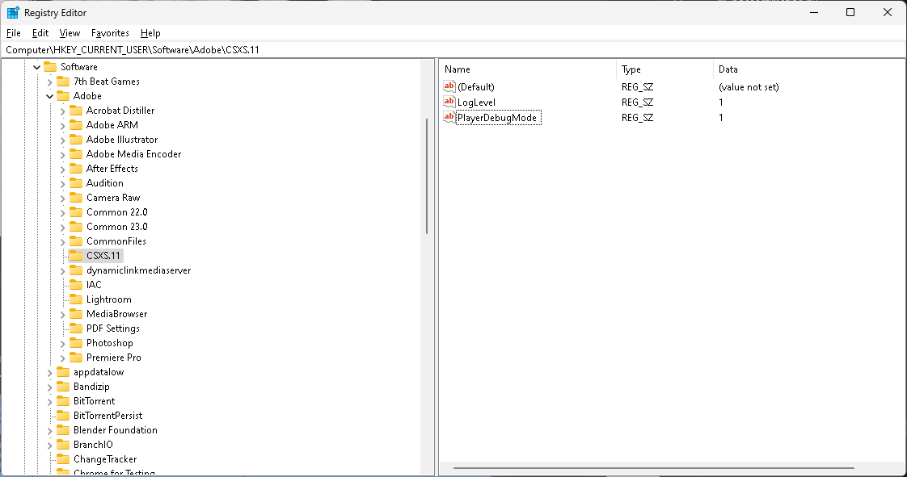
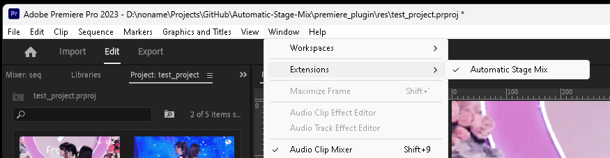
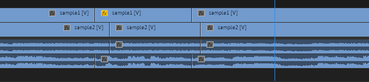
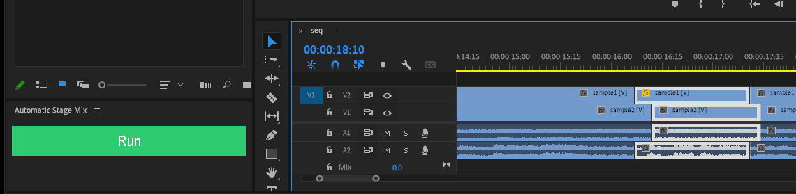
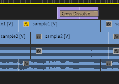

# Automatic-Stage-Mix

primire pro extension으로 얼굴 인식을 기반으로 자동으로 교차편집을 수행합니다.

https://github.com/amsminn/Automatic-Stage-Mix/assets/48761044/6feba974-8135-4492-ae96-6e76e44e1de1

## 시스템 요구 사항

- Windows10 / Windows11
- Premire Pro CC

Premire Pro 2023 / Windows11 에서 제대로 동작하는것을 확인하였습니다.

## 설치 방법

다음 명령어로 플러그인을 Premiere Pro에 설치합니다.

플러그인은 `C:/Users/{username}/AppData/Roaming/Adobe/CEP/extensions/` 경로에 설치됩니다.

다음 명령어를 실행하여 extendscript로 소스를 빌드하고 extension 설치를 수행합니다.

```bash
cd premire_plugin/host_src
npm i
npm run build
cd ..
npm i
npm run install
```

Registry Editor에서 `Computer\HKEY_CURRENT_USER\Software\Adobe\CSXS.11` 에 string value를 추가하고 Name을 "PlayerDebugMode" Data 를 "1"로 해줍니다.<br/>(unsinged extension에서 패널을 실행하기 위한 세팅입니다.)


`premiere_plugin/res/test_project.prproj` 를 열고 "Window > Extensions > Automatic Stage Mix" 를 선택하여 extension 패널을 활성화 시킵니다.


## 실행 방법

두개의 audio sync가 맞추어져 있는 video clip에서 교차편집을 원하는 부분을 자릅니다. (이때 시작 구간이 더 빠른 쪽이 트렌지션 A 클립이 되며 나머지 하나가 트랜지션 B 클립이 됩니다.)


두 클립을 선택하고 Automatic Stage Mix 의 Run 버튼을 누릅니다. (Run을 누른뒤에 실행이 끝나지 전까지 Run을 다시 누르면 안되는 이슈가 있습니다.)


교차편집이 완료된 클립이 생성된 것을 확인할 수 있습니다.

